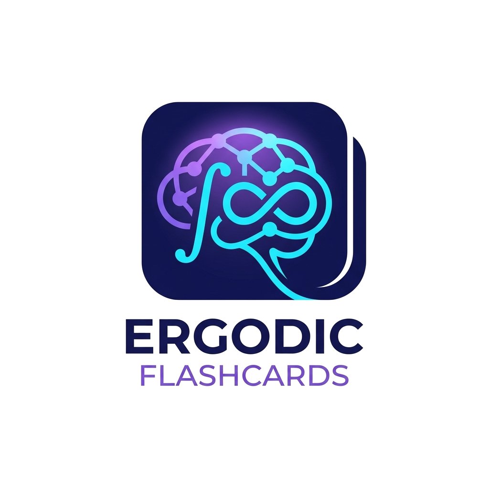

<div align="center">
  
  <h1>Ergodic Flashcards</h1>
  
  <p>
    <b>Un sistema di Spaced Repetition (SRS) locale e autonomo, potenziato dall'IA multimodale.</b>
  </p>

  <!-- Badges -->
  <p>
    
    
    
    
  </p>
</div>

<hr/>

**Ergodic Flashcards** è un'applicazione open-source progettata per studenti e matematici (con focus su Teoria Ergodica e materie STEM) che permette di caricare appunti matematici scritti a mano in PDF e convertirli automaticamente in **flashcards (Domanda/Risposta)** scritte rigorosamente in **LaTeX**. 

Costruita per aggirare le limitazioni e i login obbligatori di piattaforme web esterne (come AnkiWeb o Noji), l'app elabora, archivia e pianifica il tuo studio interamente **offline sul tuo computer** (fatta eccezione per la chiamata API velocissima verso Groq per l'estrazione visiva).

<details>
<summary>📋 <b>Indice</b></summary>

- [✨ Funzionalità Principali](#-funzionalità-principali)
- [🚀 Installazione Rapida](#-installazione-rapida)
  - [Mac (macOS)](#-installazione-su-mac-macos)
  - [Windows](#-installazione-su-windows)
- [🔑 Configurazione API (Groq)](#-configurazione-della-api-key-di-groq)
- [▶️ Come Utilizzarlo](#️-come-utilizzarlo)
</details>

## ✨ Funzionalità Principali

- 🧠 **Vision AI Multimodale**: Sfrutta la potenza di *Qwen 3.8B 27B* (su infrastruttura Groq) per "leggere" la tua calligrafia e decodificare formule matematiche complesse.
- 📝 **Supporto LaTeX Nativo**: Rendering perfetto delle tue formule matematiche. Addio copia-incolla manuale.
- 🔁 **Studio Spaziato (SRS)**: Algoritmo *SuperMemo-2 (SM-2)* integrato per calcolare l'esatto momento in cui dovresti ripassare una determinata flashcard.
- 🔒 **Privacy e Database Locale**: I tuoi progressi di studio vengono salvati in un database locale (`flashcards.json`).

---

## 🚀 Installazione Rapida

Per avviare l'app, avrai bisogno di Python 3.8+ e di **Poppler** (un tool di sistema essenziale per l'elaborazione dei file PDF).

### 🍎 Installazione su Mac (macOS)

1. **Installa Poppler** dal Terminale (richiede [Homebrew](https://brew.sh/)):
   ```bash
   brew install poppler
   ```
2. **Clona la repository**:
   ```bash
   git clone https://github.com/emanuelediluzio/ergodic-flashcards.git
   cd ergodic-flashcards
   ```
3. **Crea l'ambiente virtuale e installa le dipendenze**:
   ```bash
   python3 -m venv venv
   source venv/bin/activate
   pip install -r requirements.txt
   ```

### 🪟 Installazione su Windows

1. **Installa Poppler**:
   - Il metodo più semplice è usare [Conda](https://docs.conda.io/): `conda install -c conda-forge poppler`
   - *In alternativa*, scarica l'eseguibile di [Poppler per Windows](http://blog.alivate.com.au/poppler-windows/) e aggiungi la cartella `bin/` alle variabili d'ambiente `PATH`.
2. **Clona la repository** in PowerShell o CMD:
   ```cmd
   git clone https://github.com/emanuelediluzio/ergodic-flashcards.git
   cd ergodic-flashcards
   ```
3. **Crea l'ambiente virtuale e installa le dipendenze**:
   ```cmd
   python -m venv venv
   venv\Scripts\activate
   pip install -r requirements.txt
   ```

---

## 🔑 Configurazione della API Key di Groq

L'app richiede una chiave API per l'estrazione IA. Per non lasciare chiavi in chiaro nel codice sorgente, l'app legge la variabile d'ambiente `GROQ_API_KEY`.

**Su Mac / Linux:**
```bash
export GROQ_API_KEY="la_tua_chiave_api_gsk_..."
```

**Su Windows (PowerShell):**
```powershell
$env:GROQ_API_KEY="la_tua_chiave_api_gsk_..."
```

*(Se stai usando l'app in locale, puoi anche creare un file `.env` o inserirla nel tuo file di profilo di sistema `~/.bashrc` / `~/.zshrc`).*

---

## ▶️ Come Utilizzarlo

Una volta configurato l'ambiente, avvia l'interfaccia grafica:

```bash
streamlit run app.py
```

Si aprirà in automatico il tuo browser su `http://localhost:8501`. 

1. **Genera**: Vai nella sezione *"Generate Flashcards"* e carica il PDF con i tuoi appunti.
2. **Attendi**: L'IA analizzerà il testo in pochi secondi.
3. **Studia**: Spostati nella sezione *"Study"* per ripassare le tue carte, fornendo un feedback da *0 (Blackout)* a *5 (Facile)* per addestrare l'algoritmo di Spaced Repetition sui tuoi ritmi di apprendimento.

<br>
<p align="center">
  <i>Costruito per studiare meglio, non per studiare di più.</i>
</p>
